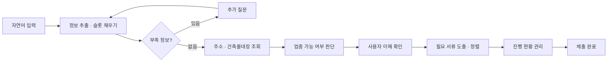

<div align="center">

# 🏛️ 허가온 (HEOGAON)

### 🪪 소상공인을 위한 AI 인허가 사전 진단 서비스

복잡한 인허가 절차를 자연어 한 문장으로 시작해, **필요한 서류·순서·소요시간·관할 부서**까지
누락 없이 안내합니다. 핵심은 한국 법령·정부 문서에서 추출한 **🧠 지식 그래프 기반 AI**입니다.

<br/>

🏆 **SSAFY × KAKAO TECH BOOTCAMP AI HACKATHON 본선 진출작** 🏆
<br/>
**전국 SSAFY 103개 팀 중 6개 팀 최종 선발 (선발률 5.8%)**

<br/>

[](https://youtu.be/qiv1yjfYUZQ)
&nbsp;&nbsp;
[](https://github.com/user-attachments/files/28921796/_.pdf)

<br/>

[](https://youtu.be/qiv1yjfYUZQ)

<sub>▶️ 썸네일을 클릭하면 시연 영상으로 이동합니다</sub>

<br/><br/>


</div>

---

## 📑 목차

- [✨ 주요 성과](#-주요-성과)
- [🤔 왜 만들었나](#-왜-만들었나)
- [💡 무엇을 하나](#-무엇을-하나)
- [✨ 핵심 기능](#-핵심-기능)
- [🔄 서비스 플로우](#-서비스-플로우)
- [🧠 그래프 기반 AI](#-그래프-기반-ai)
- [🛠️ 기술 스택](#️-기술-스택)
- [📁 프로젝트 구조](#-프로젝트-구조)
- [🚀 시작하기](#-시작하기)
- [🔑 환경 변수](#-환경-변수)
- [🔌 API 개요](#-api-개요)
- [🌱 확장 계획](#-확장-계획)
- [👥 팀](#-팀)

---

## ✨ 주요 성과

### 🚀 SSAFY × KAKAO TECH BOOTCAMP AI HACKATHON 본선 진출

- 정부 선정 **AI 민생 10대 프로젝트**를 주제로 진행된 전국 규모 해커톤에서 기술성·혁신성을 인정받아 본선에 진출했습니다.
- 참여 **103개 팀 중 6개 팀**이 선발되는 본선에 올라, 프로젝트의 완성도를 대외적으로 검증받았습니다.

---

## 🤔 왜 만들었나

처음 가게를 여는 소상공인은 행정 절차에서 막힙니다. 카페 하나를 열어도
건축과, 위생교육기관, 보건소, 위생과, 세무서, 도시경관과 등 **여러 부서·여러 서류**를
스스로 찾아 순서대로 처리해야 합니다.

> 📊 2024년 전자정부서비스 이용실태조사 (행정안전부·한국지능정보사회진흥원)
>
> | 어려움 | 응답 |
> |---|---|
> | 😵 복잡하고 많은 신청 절차 | **82.4%** |
> | 📄 필요 서류 안내 부족 | **51.8%** |
> | 🔁 추가 인증 절차 요구 | **48.6%** |

실제 예비 창업자는 이런 상태에 놓입니다.

> 🧑‍🍳 마음에 드는 1층 점포를 찾아 계약금까지 걸어둔 상태.
> 메뉴와 인테리어는 정했지만, **건물 용도와 영업신고 서류 절차는 전혀 모르는** 상태.

✅ 허가온은 이 막막함을 **"무엇을, 어떤 순서로, 어디서"** 로 바꿔 줍니다.

---

## 💡 무엇을 하나

사용자가 💬 *"마포구 망원동에서 15평 카페를 창업하고 싶어요"* 라고 입력하면, 허가온은

1. 🔍 문장에서 **위치·업종·판매품목·시설계획** 등 핵심 정보를 추출하고
2. ❓ 부족한 정보는 **추가 질문**으로 보완하며
3. 🏢 주소 API와 **건축물대장**을 조회해 그 위치에서 **영업이 가능한지 사전 진단**하고
4. 📋 가능하다면 **필요한 서류 목록을 누락 없이 도출**해
5. ⏱️ **소요시간·선행관계·관할 부서**를 고려한 우선순위로 정렬하고
6. ✍️ 각 서류의 **작성 가이드와 발급처 링크**를 제공한 뒤
7. 📊 **진행 현황**을 끝까지 관리합니다.

📱 모든 단계는 모바일 우선(최대 412px) 화면으로 설계되어, 스마트폰에서 대화하듯 진행됩니다.

---

## ✨ 핵심 기능

| 기능 | 설명 |
|---|---|
| 🧩 **맞춤 정보 수집** | 자연어 입력에서 슬롯을 추출하고, 부족한 항목만 골라 질문 (필드당 최대 2회, 총 10문항 이내) |
| 🩺 **AI 사전 진단** | 건축물대장·주소·서울 인허가 이력을 종합해 `가능 / 부서확인 필요 / 불가` 판단과 **근거** 제시 |
| 📋 **서류 소요시간·우선순위** | 선행관계·처리일수·관할 부서를 고려해 준비 순서를 자동 정렬 |
| ✍️ **AI 서류 작성 가이드** | 영업신고서 등 서류를 항목별로 올바르게 작성하도록 안내 |
| 📊 **진행 상태 관리** | 완료 체크에 따라 잠금/해제가 갱신되는 진행 대시보드 |

---

## 🔄 서비스 플로우

백엔드가 상태 머신을 소유하고, 프론트엔드는 응답의 `view.type` 에 맞는 화면만 렌더링하는
**씬 클라이언트(thin client)** 구조입니다.



| 단계 | 화면 | 역할 |
| --- | --- | --- |
| 1️⃣ 정보 수집 | `LandingScreen` | 자연어로 창업 계획 입력 |
| 2️⃣ 부족정보 질문 | `SlotQuestionView` / `AddressSearchView` | 단일·다중 선택·자유 입력, 카카오맵+건축물대장 주소 조회 |
| 3️⃣ 사전 진단 | `DiagnosisView` | 가능 여부 판단 + 건축물대장 요약 + 근거 |
| 4️⃣ 이해 확인 | `UnderstandingReviewView` | 수집된 정보 요약·확인 (수정 시 되돌아가기) |
| 5️⃣ 서류 준비 | `DocumentsView` | 우선순위 타임라인, 작성 가이드, 발급처 링크 |
| 6️⃣ 진행 현황 | `DashboardView` | 진행률·다음 할 일·잠긴 서류 표시 |
| 7️⃣ 제출 완료 | `SubmittedView` | 완료 서류·제출 안내 |

> 📖 서비스 플로우의 정본은 [`docs/FLOW.md`](docs/FLOW.md) 입니다.

---

## 🧠 그래프 기반 AI

허가온의 차별점은 답변을 **법령·정부 문서로 검증된 지식 그래프**에 근거시킨다는 점입니다.
LLM 단독 생성이 아니라, 그래프가 사실의 단일 출처(source of truth) 역할을 합니다.

**🏗️ 그래프 구축 (오프라인)**

```
규정 데이터 → 청킹 → LLM 관계 분석 → 노드·엣지 생성 → 지식 그래프
```

**⚡ 질의 (런타임)**

```
사용자 입력 → 조건 추출 → 그래프 탐색 → 필요 서류 · 부서 · 일정 도출
```

📦 체크인된 최종 그래프(`heogaon/graph/output/final_graph/`) 규모:

- 🔵 **노드 2,069개** (12종) — 서류 449, 법적근거 278, 인허가 절차 249, 확인항목 213, 조건모듈 174, 리스크 112, 근거 청크 461 …
- 🔗 **엣지 3,429개** (12종) — `requires_document` 661, `needs_check` 215, `requires_prerequisite` 24, `precedes` 16, `handled_by` 12 …
- 🧾 모든 핵심 엣지는 **근거 청크(법령·생활법령·정부24 원문)** 로 추적 가능

🛟 **3단계 폴백** — 외부 서비스가 없어도 동작합니다.

| 영역 | 1순위 | 2순위 | 3순위 (데모) |
| --- | --- | --- | --- |
| 정보 추출 / 판단 | GMS LLM | 규칙 기반 | — |
| 서류 / 질문 / 근거 | 원격 GraphRAG | 로컬 그래프 CSV | 카탈로그 상수 |

🗺️ 그래프는 **기능 단위의 부서**(예: "위생 업무")로 저장하고, 질의 시점에
[`department_mapping`](heogaon/department_mapping/)(서울 25개 자치구)으로 구체 부서명을 매핑합니다.
덕분에 그래프를 복제하지 않고 지역을 확장할 수 있습니다.

---

## 🛠️ 기술 스택

**🖥️ 프론트엔드**

- Next.js 15.3 (App Router), React 19.1, TypeScript 5.8
- UI 프레임워크 없이 순수 React + CSS 디자인 시스템 (토큰·모션·접근성 내장)
- 모바일 우선 레이아웃, `localStorage` 세션 복원, 카카오맵 SDK 연동

**⚙️ 백엔드**

- FastAPI 0.115+, Uvicorn, Pydantic 2
- 인메모리 케이스 상태 머신 (`UNDERSTAND → NEEDS_INFO → DIAGNOSIS → CONFIRM_UNDERSTANDING → DOCUMENTS → DASHBOARD → SUBMITTED`)
- LLM은 GMS(OpenAI 호환) 게이트웨이 사용, 키 없으면 규칙 기반 폴백

**🧠 AI · 데이터 파이프라인 (`heogaon/`)**
- 인테이크(슬롯 추출 · 시나리오 라우팅), 의사결정 엔진(인허가 가능성 판단)
- 지식 그래프(CSV) + SQLite(서류 발급 가이드 · 부서 매핑)
- 외부 API: JUSO(주소), 건축HUB(건축물대장), 서울 LOCALDATA(영업 이력)

---

## 📁 프로젝트 구조

```
HEOGAON/
├── app/                  # Next.js App Router (page, layout, admin, styles)
├── src/
│   ├── components/       # views / shell / common / dev
│   ├── lib/              # api, address, viewState, devMocks
│   └── types/flow.ts     # ApiView · TurnInput · DocumentItem 등 계약
├── backend/
│   └── app/
│       ├── main.py       # FastAPI 진입점 · 라우트 · 주소 검색
│       ├── core/         # 환경 설정
│       ├── integrations/ # LLM 클라이언트 (GMS)
│       ├── services/     # flow / question_planner / view_builder / document / HEOGAON 브리지 …
│       ├── repositories/ # 인메모리 케이스 저장소
│       └── data/         # 카탈로그(질문·서류 규칙) 폴백
├── heogaon/                # 도메인 AI 파이프라인
│   ├── intake/           # 슬롯 추출 · 시나리오 · 요구사항 그래프
│   ├── decision_engine/  # 인허가 가능성 판단
│   ├── graph/output/final_graph/   # 지식 그래프 CSV (노드/엣지)
│   ├── document_issue_guide/        # 서류 발급 가이드 (SQLite)
│   └── department_mapping/          # 서울 자치구 부서 매핑 (SQLite)
├── docs/FLOW.md     # UX 플로우 정본
├── docs/RUNTIME.md     # 런타임 구성 메모
├── scripts/start.ps1     # 프론트+백엔드 동시 실행
└── .env.example          # 환경 변수 템플릿
```

---

## 🚀 시작하기

### 📋 사전 준비

- Node.js 18+ (권장 22), Python 3.12
- 루트에 `.env` 파일 ([🔑 환경 변수](#-환경-변수) 참고). 키가 없어도 규칙 기반 폴백으로 데모는 동작합니다.

### 1️⃣ 저장소 클론 & 환경 파일

```bash
git clone <repository-url> HEOGAON
cd HEOGAON
cp .env.example .env   # 값 채우기 (Windows: copy .env.example .env)
```

### 2️⃣ 한 번에 실행 (Windows / PowerShell)

```powershell
.\scripts\start.ps1
# 종료: .\scripts\stop.ps1
```

- 🌐 프론트엔드: http://127.0.0.1:3103
- 🔧 백엔드: http://127.0.0.1:4100
- 📂 로그: `./logs/`

### ⚡ 직접 실행

**🔧 백엔드**

```bash
cd backend
python -m venv .venv
# Windows: .venv\Scripts\activate   |   macOS/Linux: source .venv/bin/activate
pip install -r requirements.txt
python -m uvicorn app.main:app --host 127.0.0.1 --port 4100
```

**🌐 프론트엔드**

```bash
npm install
npm run dev    # http://127.0.0.1:3103
```

> 🐳 컨테이너 배포용 `Dockerfile`(프론트엔드)과 `backend/Dockerfile`도 포함되어 있습니다.

---

## 🔑 환경 변수

모든 키는 **루트 `.env` 한 파일**에서 프론트엔드와 백엔드가 함께 읽습니다.
🔒 실제 키는 절대 커밋하지 마세요. 전체 템플릿은 [`.env.example`](./.env.example) 참고.

| 변수 | 용도 |
| --- | --- |
| `NEXT_PUBLIC_HEOGAON_API_BASE_URL` | 백엔드 API 주소 (예: `http://127.0.0.1:4100`) |
| `NEXT_PUBLIC_KAKAO_JS_KEY` | 카카오 **JavaScript** 키 (REST 키 아님, 도메인 등록 필요) |
| `LLM_API_KEY` / `LLM_MODEL` / `LLM_BASE_URL` | GMS(OpenAI 호환) LLM 설정 (`GMS_*` 별칭 폴백) |
| `JUSO_API_KEY` | 행정안전부 주소 정규화 API |
| `DATA_GO_KR_SERVICE_KEY` | 국토교통부 건축물대장(건축HUB) API |
| `KAKAO_REST_API_KEY` | 카카오 주소 검색 REST API |
| `SEOUL_LOCALDATA_INDEX` | 서울 인허가 이력 데이터 인덱스 |
| `ADMIN_PASSWORD` | 관리자 패널 비밀번호 (비우면 관리자 API 차단) |
| `CORS_ALLOWED_ORIGINS` | 허용 오리진 목록 |
| `ENABLE_GRAPH_RAG` 외 | 원격 GraphRAG 사용 시 (선택) |

---

## 🔌 API 개요

| 메서드 | 엔드포인트 | 설명 |
| --- | --- | --- |
| `GET` | `/health` | 헬스 체크 |
| `POST` | `/api/cases` | 자연어 입력으로 케이스 생성 |
| `GET` | `/api/cases/{case_id}` | 케이스 조회 (세션 복원) |
| `POST` | `/api/cases/{case_id}/turns` | 답변·액션·서류 토글 등 턴 적용 |
| `GET` | `/api/address/search` | 주소 검색 (카카오 → JUSO 폴백) |
| `*` | `/api/admin/...` | 서류·부서 DB 관리 (`X-Admin-Password` 인증) |

📨 모든 응답은 `view`(현재 화면) + `statePatch`(공유 상태) + 메타데이터를 담은 **envelope** 형태입니다.

---

## 🌱 확장 계획

- 🌍 **대상 지역·업종 확장** — 전국 지자체 조례/부서 정보 연계, 업종 다변화
- 🔗 **문서 연계·캘린더 연동** — 카카오톡 톡서랍·캘린더 등 문서 보관 시스템 연결
- 🏛️ **정부 서비스 연동** — 앱 내 신청·접수·처리 확인까지 확장
- 📈 **기대 효과** — 준비 시간 단축, 서류 오류 감소, 진행 관리 효율화, 소상공인 부담 완화

---

## 👥 팀

**허가온앤온**

| 역할 | 이름 |
| --- | --- |
| 👑 팀장 | 조성익 |
| 🧑‍💻 팀원 | 고은찬, 김경민, 남주현, 박종화, 장민주 |

---
